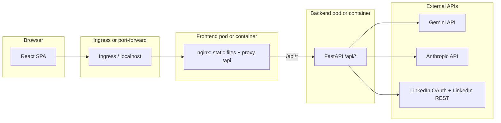

# LinkedIn AI Agent — Full Stack (React + FastAPI)

This document is the **single source of truth** for how the application works, how it is deployed, and how data flows through it. It is written so **other engineers, agents, and AI tools** can understand the system **without browsing the full codebase**.

---

## Table of contents

1. [Purpose](#1-purpose)
2. [High-level architecture](#2-high-level-architecture)
3. [Repository layout](#3-repository-layout)
4. [Runtime flows](#4-runtime-flows)
5. [Environment variables](#5-environment-variables)
6. [HTTP API (backend)](#6-http-api-backend)
7. [LinkedIn OAuth](#7-linkedin-oauth)
8. [Local run: Docker Compose](#8-local-run-docker-compose)
9. [Production-style images](#9-production-style-images)
10. [Kubernetes / Helm](#10-kubernetes--helm)
11. [Ingress and accessing the UI](#11-ingress-and-accessing-the-ui)
12. [LinkedIn Developer Portal checklist](#12-linkedin-developer-portal-checklist)
13. [Security and secrets](#13-security-and-secrets)
14. [Troubleshooting](#14-troubleshooting)
15. [Optional: CLI token script](#15-optional-cli-token-script)
16. [Tech stack](#16-tech-stack)

---

## 1. Purpose

A **personal** web application that:

- Uses **Google Gemini** or **Anthropic Claude** (auto-selected from configured API keys) to generate LinkedIn-style content in three modes: **content**, **brand**, **job hunt**.
- Optionally **posts** generated text to the user’s LinkedIn profile using a **member OAuth access token** and **person URN**.

It is **not** a multi-tenant SaaS: configuration is via environment variables and optional on-disk token storage.

---

## 2. High-level architecture



**Important:** All backend HTTP routes live under the **`/api`** prefix (for example `/api/status`). The Vite dev server (Compose) and the **production nginx** image both forward browser requests from **`/api/...`** to the backend so the browser can use **same-origin** relative URLs (`/api/...`) and avoid CORS issues for normal usage.

---

## 3. Repository layout

| Path | Role |
|------|------|
| `backend/main.py` | FastAPI app: health, status, AI generation, LinkedIn post, OAuth start/callback, CORS, token persistence. |
| `backend/requirements.txt` | Python dependencies. |
| `backend/Dockerfile` | Dev image: uvicorn with `--reload` (Docker Compose). |
| `backend/Dockerfile.prod` | Prod image: uvicorn without reload (Kubernetes / static deploys). |
| `frontend/` | React (Vite) SPA: pages, `StatusBar`, `OutputPanel`, `useApi.js`. |
| `frontend/Dockerfile` | Dev: `npm run dev` (Compose). |
| `frontend/Dockerfile.prod` | Prod: `npm run build` + nginx; proxies `/api/` to backend via `BACKEND_HOST`. |
| `frontend/nginx/default.conf.template` | nginx template; `BACKEND_HOST` substituted at container start. |
| `frontend/vite.config.js` | Dev proxy: `/api` → backend (Compose service name `backend:8000`). |
| `docker-compose.yml` | Runs backend + frontend; sets OAuth-related env and a volume for `DATA_DIR`. |
| `step1_get_token.py` | **Optional** CLI OAuth that writes `.env` (legacy / no-UI workflows). |
| `chart/linkedin-agent/` | Helm chart: Deployments, Services, Ingress, Secret (or `existingSecret`). |
| `.env` | Local secrets (never commit). Example keys documented in section 5. |

Additional design notes for maintainers may exist under `../CURSOR_CONTEXT.md` (relative to repo root in some layouts); **this README** is the canonical onboarding doc for **deploy + behavior**.

---

## 4. Runtime flows

### 4.1 Generate content (all UI modes)

1. User submits text in **Content**, **Brand**, or **Job** page.
2. Frontend `useApi.js` sends `POST /api/generate` with JSON `{ "mode": "content" \| "brand" \| "job", "input": "..." }`.
3. Backend builds a mode-specific prompt, calls **Gemini** or **Anthropic** based on configured keys, returns `{ "result": "...", "mode": "..." }`.
4. `OutputPanel` shows the result; user may copy or post.

### 4.2 Post to LinkedIn

1. User clicks **Post to LinkedIn** in `OutputPanel`.
2. Frontend sends `POST /api/post-to-linkedin` with `{ "text": "..." }`.
3. Backend calls LinkedIn **UGC Posts** API with `Authorization: Bearer <access_token>` and `author: <person URN>`.

Requires a valid **access token** and **person URN** (from OAuth or env).

### 4.3 Connect LinkedIn (in-app OAuth — preferred)

1. `GET /api/status` exposes `linkedin_connected` and `linkedin_oauth_ready` (client id + secret look configured).
2. If not connected and OAuth is ready, **StatusBar** shows **Connect LinkedIn**.
3. User navigates to **`GET /api/linkedin/start`**: backend issues a **302** to LinkedIn’s authorize URL with a short-lived **state** (CSRF mitigation).
4. User approves on LinkedIn; LinkedIn redirects the browser to **`LINKEDIN_REDIRECT_URI`** (must be **exactly** registered in the LinkedIn app), hitting **`GET /api/linkedin/callback?code=...&state=...`**.
5. Backend validates `state`, exchanges `code` for tokens, fetches **OpenID userinfo** to build `urn:li:person:<sub>`, persists session to **`$DATA_DIR/linkedin_tokens.json`** (default file name unless overridden), updates in-memory credentials, then redirects to **`LINKEDIN_OAUTH_SUCCESS_URL`**.

**The browser never runs `step1_get_token.py`.** That script is optional for CLI-only workflows.

---

## 5. Environment variables

| Variable | Required | Description |
|----------|----------|-------------|
| `GEMINI_API_KEY` | One of Gemini or Anthropic | Google AI Studio key. |
| `ANTHROPIC_API_KEY` | Optional | If set and not placeholder, **Claude** is preferred over Gemini. |
| `LINKEDIN_CLIENT_ID` | For OAuth | LinkedIn app Client ID. |
| `LINKEDIN_CLIENT_SECRET` | For OAuth | LinkedIn app **Client secret** (not a Google API key). |
| `LINKEDIN_ACCESS_TOKEN` | For posting | Member access token (can be empty if using UI OAuth + file persistence). |
| `LINKEDIN_PERSON_URN` | For posting | e.g. `urn:li:person:<id>` (can be empty if filled by OAuth persistence). |
| `CORS_ORIGINS` | Recommended | Comma-separated browser origins allowed to call the API (needed for dev / alternate hosts). |
| `LINKEDIN_REDIRECT_URI` | For in-app OAuth | **Must match** an authorized redirect URL in the LinkedIn app. Example (Compose): `http://localhost:8000/api/linkedin/callback`. Example (ingress host `linkedin-agent.local`): `http://linkedin-agent.local/api/linkedin/callback`. |
| `LINKEDIN_OAUTH_SUCCESS_URL` | Optional | Browser redirect after successful OAuth (default UI URL with query). |
| `LINKEDIN_OAUTH_ERROR_URL` | Optional | Browser redirect on OAuth errors. |
| `DATA_DIR` | Optional | Directory for `linkedin_tokens.json` (default `.` if unset). Compose sets `/app/data` with a volume. |
| `LINKEDIN_TOKEN_FILE` | Optional | Override full path to token JSON instead of `$DATA_DIR/linkedin_tokens.json`. |

**Persistence rule:** On startup, if `linkedin_tokens.json` exists under `DATA_DIR` (or `LINKEDIN_TOKEN_FILE`), its `access_token` and `person_urn` **override** `LINKEDIN_*` from the environment for the running process. This allows OAuth in Kubernetes without editing Secrets on every login (token still lives in the pod filesystem unless you use a PVC).

---

## 6. HTTP API (backend)

All routes below are rooted at **`/api`**.

| Method | Path | Purpose |
|--------|------|---------|
| GET | `/api/health` | Liveness: `status`, `provider`, `linkedin_connected`. |
| GET | `/api/status` | UI status: AI provider, model label, `linkedin_connected`, `linkedin_oauth_ready`, `linkedin_urn`. |
| POST | `/api/generate` | Body: `{ "mode", "input" }` → generated text. |
| POST | `/api/post-to-linkedin` | Body: `{ "text" }` → creates a LinkedIn post. |
| GET | `/api/linkedin/start` | Starts OAuth (302 to LinkedIn). Returns 503 if client id/secret not configured. |
| GET | `/api/linkedin/callback` | LinkedIn redirect target; exchanges code; persists token; 302 to success/error URL. |

Interactive OpenAPI (when running backend directly): **`http://<backend-host>:8000/docs`** (FastAPI root docs; paths are still under `/api/...`).

---

## 7. LinkedIn OAuth

- **Scopes used:** `openid profile w_member_social` (same family as the CLI script).
- **Critical:** The **`redirect_uri`** sent to LinkedIn is exactly **`LINKEDIN_REDIRECT_URI`**. The LinkedIn Developer app must list that **full URL** under **Authorized redirect URLs for your app**. A mismatch produces LinkedIn’s error: *“The redirect_uri does not match the registered value”*.
- **Examples of redirect URLs to register** (register only what you actually use):
  - Docker Compose (backend exposed on 8000): `http://localhost:8000/api/linkedin/callback`
  - Ingress host `linkedin-agent.local`: `http://linkedin-agent.local/api/linkedin/callback`
- **Success / error redirects** are normal HTTP 302s to the SPA so the user returns to the UI.

---

## 8. Local run: Docker Compose

1. Copy env template if needed, fill secrets (never commit real values).
2. Ensure LinkedIn redirect URL is registered for the URI Compose uses (see `docker-compose.yml` `environment` on the backend service).
3. From repo root:

```bash
docker compose up --build
```

| Service | URL |
|---------|-----|
| Frontend (Vite) | http://localhost:3000 |
| Backend (FastAPI) | http://localhost:8000 |
| OpenAPI docs | http://localhost:8000/docs |

Compose mounts a **named volume** for `/app/data` so OAuth tokens survive backend container restarts.

---

## 9. Production-style images

```bash
docker build -t linkedin-agent-backend:latest -f backend/Dockerfile.prod backend/
docker build -t linkedin-agent-frontend:latest -f frontend/Dockerfile.prod frontend/
```

The frontend image serves static files and proxies **`/api/`** to **`http://${BACKEND_HOST}/api/`** (Helm sets `BACKEND_HOST` to the cluster DNS name of the backend Service).

---

## 10. Kubernetes / Helm

Chart path: **`chart/linkedin-agent/`**.

### 10.1 What the chart installs

- **Backend Deployment** + **ClusterIP Service** (port 8000): FastAPI, `envFrom` a Kubernetes **Secret**, extra env for `CORS_ORIGINS`, `DATA_DIR`, `LINKEDIN_REDIRECT_URI`, OAuth success/error URLs (built from `ingress.host` + `linkedin.oauthScheme` + paths in `values.yaml`).
- **Frontend Deployment** + **ClusterIP Service** (port 80): nginx + built SPA, `BACKEND_HOST` pointing at the backend Service FQDN.
- **Ingress** (optional): routes host (e.g. `linkedin-agent.local`) to the **frontend** Service; `/api` traffic is handled by **nginx inside the frontend pod** (not a separate Ingress path rule for `/api`).
- **Secret** (optional): if `existingSecret` is empty, chart creates `*-env` with stringData keys matching backend env names.

### 10.2 Recommended: credentials via Kubernetes Secret

Avoid passing secrets on the `helm` command line (shell history, `helm get values`).

```bash
kubectl create secret generic linkedin-agent-credentials \
  --namespace <namespace> \
  --kube-context <context> \
  --from-literal=GEMINI_API_KEY='...' \
  --from-literal=ANTHROPIC_API_KEY='' \
  --from-literal=LINKEDIN_CLIENT_ID='...' \
  --from-literal=LINKEDIN_CLIENT_SECRET='...' \
  --from-literal=LINKEDIN_ACCESS_TOKEN='' \
  --from-literal=LINKEDIN_PERSON_URN=''
```

Then install:

```bash
helm upgrade --install linkedin-agent ./chart/linkedin-agent \
  --namespace <namespace> --create-namespace \
  --kube-context <context> \
  --set existingSecret=linkedin-agent-credentials \
  --set ingress.enabled=true \
  --set ingress.className=nginx \
  --set ingress.host=linkedin-agent.local
```

### 10.3 CORS and Helm `--set`

Comma-separated strings in `helm --set` are parsed poorly. The chart supports **`corsOriginsList`** (array); defaults in `values.yaml` already include common local origins. Override with indexed `--set` or a small `-f` values file if needed.

---

## 11. Ingress and accessing the UI

- **ClusterIP** Services are not reachable from your laptop by default.
- **Ingress** requires an **Ingress controller** (e.g. **ingress-nginx**) in the cluster. On Docker Desktop, after installing the controller, the **LoadBalancer** service often shows **`EXTERNAL-IP = localhost`**; then **`http://<ingress-host>/`** can work if **`/etc/hosts`** maps that host to `127.0.0.1`.
- **`kubectl get ingress`** may show an **empty `ADDRESS`** column on Docker Desktop even when routing works; verify with the browser or `curl -H "Host: <host>" http://127.0.0.1/`.
- **Reliable local access without Ingress:** port-forward the **frontend** Service:

```bash
kubectl port-forward -n <namespace> svc/<release>-frontend 8080:80 --context <context>
```

Then open **http://localhost:8080** (exact Service name from `kubectl get svc`).

---

## 12. LinkedIn Developer Portal checklist

1. Create / open the app at [LinkedIn Developers](https://www.linkedin.com/developers/apps).
2. **Auth** tab → **Authorized redirect URLs** → add **every** redirect URI you use in each environment, **character-for-character** (scheme, host, port, path; no guesswork).
3. Request / confirm products/scopes needed for posting (e.g. **`w_member_social`**) per LinkedIn’s current product model.
4. Client secret is rotated from this UI; update Kubernetes Secret or `.env` when rotated.

---

## 13. Security and secrets

- Never commit **`.env`** or real **Secret** YAML with literals to git.
- **LinkedIn client secret** is not interchangeable with a **Google API key**; wrong secrets cause `invalid_client` at token exchange.
- **Access tokens** expire (commonly on the order of **two months** for member tokens — confirm in LinkedIn docs); re-authorize via **Connect LinkedIn** or refresh strategy if you add one later.
- For Helm, prefer **`existingSecret`** + `kubectl create secret` over `--set secrets.*`.

---

## 14. Troubleshooting

| Symptom | Likely cause | What to check |
|---------|----------------|---------------|
| LinkedIn: redirect_uri does not match | Redirect URL not registered | LinkedIn app **Authorized redirect URLs** must include exact `LINKEDIN_REDIRECT_URI`. |
| `invalid_client` on token exchange | Wrong client secret | Use Client Secret from LinkedIn app, not other vendors’ keys. |
| UI: backend offline | Wrong URL / proxy / CORS | Compose: both containers up; browser uses `localhost:3000`. K8s: Ingress or port-forward; `CORS_ORIGINS` includes browser origin. |
| `ERR_CONNECTION_REFUSED` on ingress host | No listener on :80 | Install ingress controller; map host in `/etc/hosts`; or use port-forward. |
| Post fails after OAuth | Missing scopes or expired token | Re-connect; verify LinkedIn app products. |
| Helm: “key http://localhost has no value” | Commas in `--set` | Use `corsOriginsList` / `-f` values file / `existingSecret` (see chart `values.yaml`). |

---

## 15. Optional: CLI token script

`step1_get_token.py` can still write **`LINKEDIN_ACCESS_TOKEN`** and **`LINKEDIN_PERSON_URN`** into **`.env`** for workflows without the UI. It uses a **different** default redirect (`http://localhost:8000/callback` in the original script) unless you align it with the backend’s **`/api/linkedin/callback`** flow.

**Prefer in-app Connect LinkedIn** when running the full stack.

---

## 16. Tech stack

| Layer | Technology |
|-------|------------|
| UI | React 18, Vite 5, `lucide-react` |
| API | FastAPI, Uvicorn, Pydantic |
| AI | Google Gemini (`gemini-2.5-flash`) or Anthropic Messages API |
| HTTP client | `requests` |
| Containers | Docker; Compose for dev; multi-stage frontend for prod |
| Orchestration | Helm 3, Kubernetes |

---

*Maintained for Priyansh Saxena — LinkedIn AI Agent (`linkedin-agent-clean`).*
